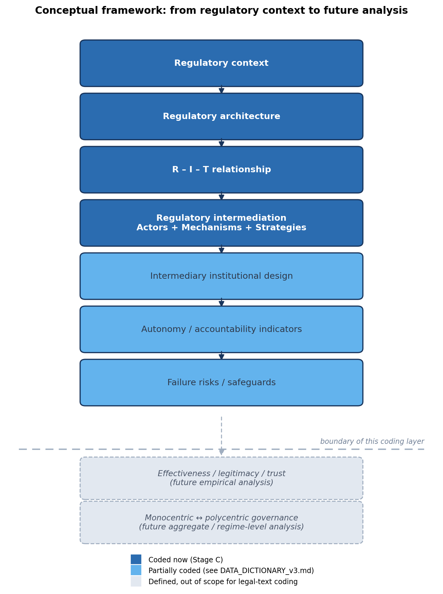
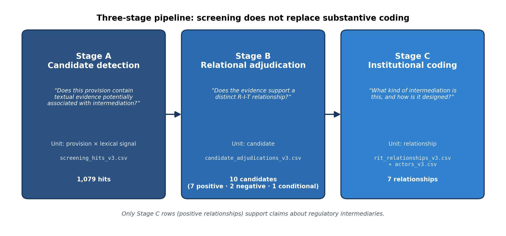
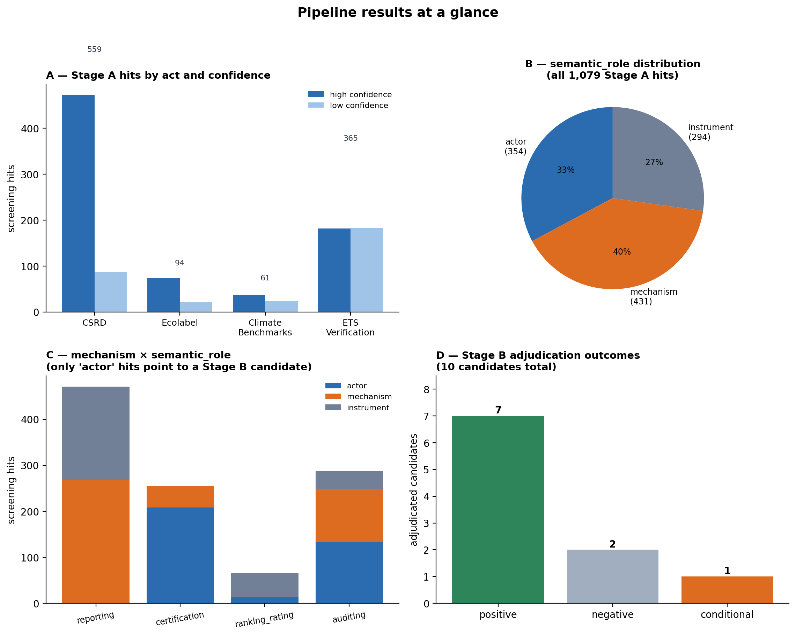
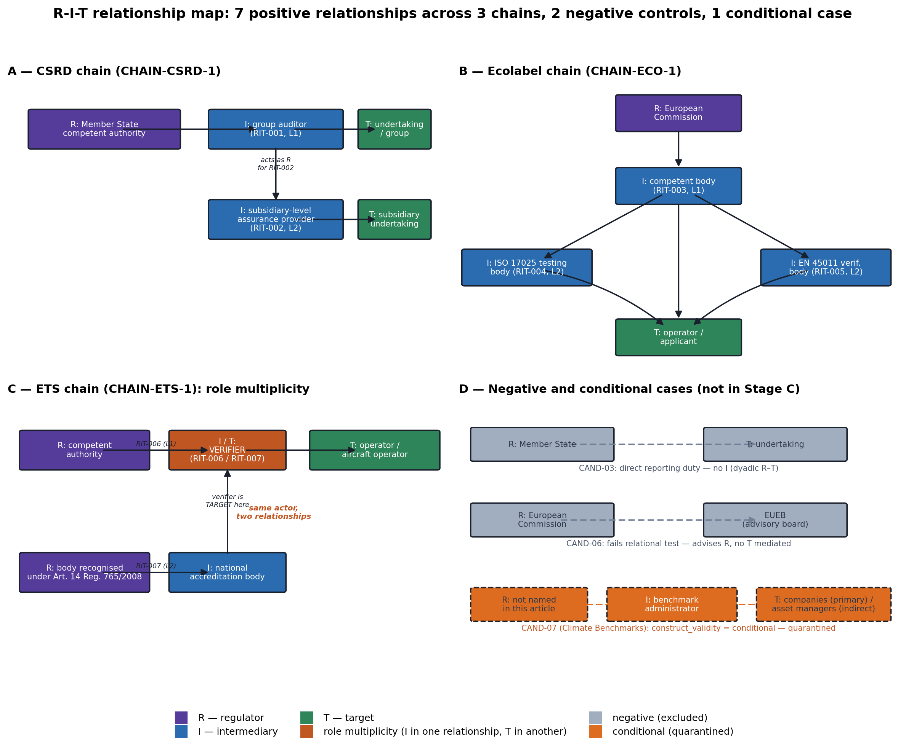

## Sumário executivo

Este relatório documenta, de forma completa e autoexplicativa, o exercício de
codificação de intermediários regulatórios realizado em resposta à chamada
do Prof. David Levi-Faur por um Research Assistant/Partner no projeto
"Governance by and of Intermediaries". Cobre: o problema teórico que motivou
o exercício; o quadro conceitual adotado; a arquitetura operacional de três
estágios (triagem lexical → adjudicação relacional → codificação
institucional); o passo a passo do que foi efetivamente executado, com
números reais; os principais achados metodológicos, incluindo um erro
encontrado e corrigido durante o próprio processo; o estado da validação; e
o que essa camada de codificação mede — e explicitamente não mede.

O exercício partiu de 4 atos legislativos da União Europeia, processou
1.079 sinais textuais de triagem, adjudicou 10 candidatos a relação
regulatória (7 positivos, 2 negativos, 1 condicional) e codificou
institucionalmente **7 relações regulador–intermediário–alvo (R-I-T)**
plenamente individualizadas, organizadas em 3 cadeias que demonstram
meta-regulação e multiplicidade de papel.

## Objetivo e escopo deste relatório

Este documento não substitui a nota de pesquisa curta preparada para o
Prof. David Levi-Faur (`RESEARCH_NOTE_v3.docx`) — serve a um propósito
diferente: registrar, com profundidade e figuras ilustrativas, exatamente
como o exercício foi conduzido, para que qualquer pessoa (incluindo o
próprio autor, em uma data futura) consiga reconstruir o raciocínio sem
depender de contexto externo. Cobre as três versões do exercício (v1, v2,
v3), mas concentra-se na arquitetura v3, atualmente em uso.

## O problema teórico

A proposta de pesquisa do Prof. Levi-Faur ("Can Intermediaries Save Liberal
Governance? Toward Effective and Legitimate Regulatory Intermediation")
parte da premissa de que a agenda de reforma democrática deve se voltar para
os **intermediários regulatórios** — os corretores de regras entre
reguladores (rule-makers) e regulados (rule-takers). A literatura de
regulação ainda trata essa relação como bipartite, deixando de teorizar
quem certifica, audita, classifica e reporta. A proposta organiza a
intermediação regulatória como uma arquitetura de **atores + mecanismos +
estratégias**, com quatro mecanismos primários — **reporting** (liderado
pelo Estado), **certification** (liderado por ONGs), **ranking/rating**
(liderado por empresas) e **auditing** (liderado pela profissão) — e um
conjunto de atributos institucionais dos intermediários (papel formal,
voluntarismo, nível, esfera, motivação, modo de operação, centralidade,
grau de separação).

A chamada específica a que este exercício responde pede a codificação
desses intermediários na legislação da União Europeia sobre transição
verde. O desafio metodológico central — descoberto e corrigido ao longo de
três rodadas deste exercício — é que **triagem lexical de mecanismos não é
o mesmo que codificação de intermediários**: um parágrafo pode conter a
palavra "auditor" sem que exista, ali, uma relação regulatória
identificável entre um regulador, um intermediário e um alvo.

## Quadro conceitual

O exercício adota explicitamente a arquitetura abaixo, evitando dois erros
simétricos: tratar como já medido algo que a teoria apenas prevê para
análise futura (efetividade, legitimidade, confiança, polycentricity), e
tratar como intermediário qualquer ator mencionado perto de linguagem de
regulação.

{width=85%}

As camadas em azul-escuro são efetivamente codificadas neste exercício
(Estágio C); as em azul-claro são parcialmente codificadas (ver
`DATA_DICTIONARY_v3.md` para o que está e o que não está preenchido); as
camadas tracejadas abaixo da linha pontilhada são explicitamente **fora do
escopo** desta camada de codificação — não são medidas, nem aproximadas, a
partir do texto legal.

## Arquitetura operacional: pipeline de três estágios

O pipeline responde a três perguntas distintas, em três unidades de
análise distintas, com três datasets fisicamente separados — a separação
física existe precisamente para impedir que o resultado de um estágio seja
lido como se fosse o resultado de outro.

{width=95%}

### Estágio A — Detecção de candidatos

Pergunta: *este dispositivo contém evidência textual potencialmente
associada à intermediação regulatória?* Unidade: dispositivo × sinal
lexical. Este estágio não determina se existe um intermediário — apenas
localiza onde vale a pena olhar com atenção. Cada padrão de busca (regex)
carrega uma etiqueta de `semantic_role` (ator, mecanismo ou instrumento):
só padrões do tipo **ator** apontam diretamente para um candidato do
Estágio B.

### Estágio B — Adjudicação relacional

Pergunta: *a evidência do candidato sustenta uma relação regulatória
distinta, envolvendo um regulador, um intermediário e um alvo?* Unidade:
candidato. Aplica-se aqui o **teste relacional formal**, com cinco
condições que precisam ser satisfeitas simultaneamente:

a. Existe um regulador (R) identificável.
b. Existe um alvo/regulado (T) identificável.
c. Existe um terceiro ator, analiticamente distinto de R e de T.
d. Esse terceiro ator desempenha uma função regulatória que **medeia** a
   relação entre R e T (não apenas assessora o regulador, e não apenas
   recebe a mesma obrigação que o alvo).
e. A relação pode ser sustentada por texto legal explícito ou por
   reconstrução institucional claramente documentada.

O resultado é `positive`, `negative`, `conditional` ou
`insufficient_evidence` — nunca apenas "sim" ou "não" sem essa distinção
intermediária.

### Estágio C — Codificação institucional

Pergunta: *que tipo de intermediação regulatória é esta, e como ela é
institucionalmente desenhada?* Unidade: relação. Só candidatos `positive`
chegam a este estágio. Aqui se registram os atores (via tabela normalizada
`actors_v3.csv`), o mecanismo, e os atributos institucionais que o
dispositivo efetivamente sustenta — nunca mais do que o texto permite
inferir com responsabilidade.

## Passo a passo: o que foi efetivamente executado

### Passo 1 — Seleção e coleta dos atos

Foram selecionados 4 atos da União Europeia, um por mecanismo-âncora,
escolhidos por já serem casos conhecidos de cada mecanismo (amostra de
conveniência para calibrar o método, não amostra representativa da
legislação de transição verde como um todo):

| Ato | CELEX | Mecanismo-âncora |
|---|---|---|
| Corporate Sustainability Reporting Directive (CSRD) | `32022L2464` | reporting + auditing |
| Regulamento do Rótulo Ecológico da UE (Ecolabel) | `32010R0066` | certification |
| Regulamento de Referenciais Climáticos (Climate Benchmarks) | `32019R2089` | ranking/rating (condicional — ver seção de achados) |
| Verificação e Acreditação no EU ETS | `32018R2067` | auditing (+ certification) |

O texto integral de cada ato foi coletado da EUR-Lex por número CELEX
(`scripts/collect.py`), sem necessidade de nova coleta nas rodadas
seguintes — o mesmo HTML bruto serviu às três versões do exercício.

### Passo 2 — Execução do Estágio A (triagem lexical)

O script `scripts/screening_v3.py` processou os quatro atos
parágrafo a parágrafo, aplicando regras de três camadas por mecanismo:

- **Âncora** — termos/frases específicos o suficiente para confirmar o
  mecanismo sozinhos (`screening_confidence = high`).
- **Fraca** — termos genéricos que também ocorrem fora do sentido-alvo
  (`screening_confidence = low`).
- **Exclusão** — padrões de contexto que descartam o match mesmo com
  âncora/fraca presente (ex.: "Court of Auditors", instituição da UE, não
  um intermediário regulatório no sentido da teoria).

Resultado: **1.079 linhas** em `screening_hits_v3.csv`, 764 (71%) em alta
confiança e 315 (29%) em baixa confiança — nunca lido como "confirmado", já
que confiança lexical não é o mesmo que confirmação substantiva.

{width=95%}

O painel A mostra que cada ato tem um mecanismo dominante coerente com o
motivo da escolha. O painel B mostra que, dos 1.079 sinais, apenas 33% têm
`semantic_role = actor` — os únicos que apontam diretamente para um
candidato a intermediário; os demais 67% localizam contexto (mecanismo ou
instrumento), não um ator. O painel C detalha essa distribuição por
mecanismo: **"reporting" não tem nenhum padrão-âncora do tipo ator** —
achado consistente com a descoberta, no Estágio B, de que o dever de
reportar sozinho raramente produz um intermediário distinto (ver Passo 3).

Uma correção técnica desta rodada: dois padrões da versão anterior
misturavam mais de uma ontologia sob uma única expressão regular
(`verification (team|report|body)` misturava ator com instrumento;
`assurance (engagement|opinion|provider|services)` misturava ator com
mecanismo). Foram separados em padrões atômicos — a nova execução produziu
exatamente os mesmos 1.079 hits totais, confirmando que a correção mudou a
metadados, não o comportamento de correspondência.

### Passo 3 — Execução do Estágio B (adjudicação relacional)

A partir dos parágrafos mais densos em sinal do Estágio A, li o texto
completo de um artigo-chave por ato e apliquei o teste relacional de cinco
condições a cada candidato. Resultado: **10 candidatos adjudicados**
(painel D da Figura acima) — **7 positivos, 2 negativos, 1 condicional.**

Os dois casos negativos foram mantidos deliberadamente, porque demonstram
que o teste discrimina, e não apenas confirma:

- **CSRD, dever direto de reportar** (Art. 19a, via Art. 1): a empresa
  inclui informação de sustentabilidade no relatório de gestão diretamente
  para o Estado-Membro — sem nenhum terceiro ator mediando. Relação diádica
  R–T, não R-I-T (`reporting_mechanism_present = 1`,
  `intermediary_present = 0`).
- **Ecolabel, Comitê Europeu do Rótulo Ecológico (EUEB)** (Art. 5): assessora
  a Comissão na definição de critérios — participa da própria formulação da
  regra, não medeia uma relação regulador–alvo já existente.

O caso condicional — Climate Benchmarks — é discutido separadamente na
seção de achados, por merecer atenção própria.

### Passo 4 — Execução do Estágio C (codificação institucional)

Os 7 candidatos positivos foram promovidos a relações plenamente
codificadas em `rit_relationships_v3.csv`, com atores normalizados em
`actors_v3.csv` (19 identidades distintas). A regra de normalização
central: **uma linha, uma relação** — nenhuma célula pode conter mais de um
ator simultâneo representando relações distintas. Quando o Regulamento do
Rótulo Ecológico (Art. 9(7)) menciona dois tipos de organismo acreditado
(testes ISO 17025 e verificação EN 45011) como funções distintas, isso
gerou **duas** relações separadas (RIT-004 e RIT-005), não uma célula
composta.

{width=98%}

## Achados principais

### Cadeias de meta-regulação

Em três dos quatro atos, um intermediário aparece, ele próprio, governado
por outro intermediário ou por um regulador de segundo nível — o que a
própria proposta do David chamaria de meta-regulação/autorregulação
aprimorada:

- **CSRD**: o *group auditor* supervisiona um *subsidiary-level assurance
  provider* na avaliação de subsidiárias do mesmo grupo (painel A da
  Figura 3).
- **Ecolabel**: o *competent body* se apoia em organismos de teste (ISO
  17025) e verificação (EN 45011) separadamente acreditados (painel B).
- **EU ETS**: o organismo nacional de acreditação — que credencia o
  verificador — está ele próprio sujeito a avaliação por pares por um órgão
  reconhecido nos termos do Artigo 14 do Regulamento (CE) n.º 765/2008
  (painel C).

### Multiplicidade de papel

O caso mais rico da amostra: o **verificador do EU ETS** é o intermediário
na relação entre a autoridade competente e o operador (RIT-006), e é
simultaneamente o **alvo** da sua própria relação de acreditação com o
organismo nacional de acreditação (RIT-007). A identidade do ator
(`actors_v3.csv`) nunca armazena um papel fixo — o papel é sempre uma
propriedade da relação, nunca do ator.

### Um erro encontrado e corrigido durante o próprio processo

A primeira leitura da cadeia de acreditação do ETS (o que se tornaria
RIT-007) codificou o organismo nacional de acreditação como regulador (R),
sem nenhum intermediário distinto — uma leitura diádica que, se mantida,
teria comprometido a própria alegação de multiplicidade de papel. Ao reler
a evidência já disponível (o texto sobre a avaliação por pares do órgão do
Artigo 14), ficou claro que o organismo nacional de acreditação ocupa a
posição de **intermediário**, não de regulador — o regulador é o órgão de
avaliação por pares. Essa correção está documentada, não escondida, na nota
de adjudicação do candidato correspondente (`CAND-09` em
`candidate_adjudications_v3.csv`) — o processo de encontrar e corrigir esse
erro é, em si, evidência de que o teste relacional está fazendo trabalho
real, não apenas confirmando uma primeira impressão.

### Caso condicional: Climate Benchmarks

O administrador do referencial climático seleciona, pondera e exclui
ativos segundo um padrão pré-definido de trajetória de descarbonização —
uma ação que lembra "rating" no sentido da teoria. Mas o regulador não é
nomeado no dispositivo lido, e o alvo é duplo e indireto: as empresas cujos
ativos são pontuados (alvo primário) e os gestores de ativos que usam o
selo do referencial (alvo secundário, indireto). Em vez de forçar o
enquadramento, o caso foi mantido em **quarentena analítica**
(`construct_validity = conditional`), não promovido a `rit_relationships_v3.csv`,
com a pergunta registrada para discussão direta com o Prof. Levi-Faur: isto
é um intermediário regulatório de fato, ou principalmente um provedor de
índice regulado pelo próprio regime de referenciais?

## Validação

### Estágio A — amostra de referência (não mais chamada de "padrão-ouro")

Para um artigo por ato, todo o texto foi lido manualmente, sem uso de
regex, marcando se cada parágrafo tratava substantivamente de
intermediação. Essa leitura foi comparada ao que a triagem automática
encontrou nos mesmos parágrafos.

**Resultado (35 unidades julgadas): precisão de 100% (33/33), recall de
94,3% (33/35), F1 de 97,1%.** Os dois erros de recall compartilham uma
causa: o parágrafo descreve a mesma relação pelo lado do regulador ou do
alvo, sem repetir o nome do intermediário — um limite conhecido de
triagens ancoradas em substantivo, não um problema de amostra.

O termo "padrão-ouro" foi deliberadamente abandonado em favor de "amostra
de referência adjudicada manualmente" — o termo anterior sugeria uma
finalidade que uma amostra pequena e não aleatória não sustenta.

### Estágios B e C — protocolo escrito, ainda não executado

A validação de confiabilidade entre codificadores (um segundo codificador
aplicando o mesmo `RIT_CODEBOOK_v3.md` aos mesmos quatro artigos, às cegas
em relação a este resultado) está totalmente protocolada em
`RELATIONSHIP_VALIDATION_PROTOCOL_v3.md`, mas **não foi executada** — não
há, ainda, um segundo codificador disponível. Isso é registrado
explicitamente como pendência, não maquiado como concluído: sete relações
codificadas por uma única pessoa demonstram que a arquitetura é executável,
não que é confiável entre codificadores independentes.

## O que esta camada de codificação mede — e o que não mede

**Mede, com responsabilidade:** identidade dos atores e atribuição de papel
R-I-T; mecanismo primário e secundário; um subconjunto de atributos
institucionais (papel formal, voluntarismo, nível, esfera, modo de
operação, separação organizacional); dois indicadores de governança
(exigência de independência, supervisão presente) — cada um com evidência
textual verbatim associada.

**Não mede, e não finge medir:** motivação do intermediário (não pode ser
inferida com segurança da forma organizacional); centralidade institucional
(explicitamente não é frequência de menção lexical); as baterias completas
de autonomia e accountability; as estratégias de responsibilization e
empowerment (definidas como duas dimensões independentes, não
dicotômicas, mas ainda não pontuadas); e, no nível mais alto, efetividade,
legitimidade, confiança e o posicionamento monocêntrico/policêntrico do
regime — explicitamente reservados para análise empírica e agregada futura,
fora do alcance evidencial de uma camada de codificação de texto legal.

## Limitações

- A amostra de 10 candidatos/7 relações vem de um artigo por ato, não de
  leitura exaustiva dos quatro atos inteiros — suficiente para exercitar
  cada regra do codebook, insuficiente para reivindicar cobertura de
  corpus.
- A validação do Estágio A usa uma amostra pequena e não aleatória (os
  artigos mais ricos de cada ato) — um teto otimista, não uma estimativa
  para o restante do corpus.
- Os Estágios B e C carecem de validação por segundo codificador.
- A população de "legislação da UE sobre transição verde" ainda não foi
  definida por escrito — passo que precede qualquer expansão via
  SPARQL/Cellar.

## Próximos passos

1. Definir a população e o sampling frame por escrito antes de qualquer
   consulta em escala à API SPARQL/Cellar.
2. Executar o protocolo de validação entre codificadores para os Estágios
   B/C.
3. Resolver com o Prof. Levi-Faur a questão de validade de construto do
   caso Climate Benchmarks.
4. Preencher as baterias de autonomia, accountability e estratégias uma vez
   disponível um segundo codificador.

## Conclusão

A intermediação regulatória foi operacionalizada aqui como um construto
relacional, não uma categoria lexical. A triagem localiza candidatos; a
adjudicação relacional determina se existe, de fato, uma estrutura R-I-T —
preservando desfechos negativos e condicionais como evidência de validade
discriminante, não descartando-os; a codificação institucional registra
mecanismos e os atributos que o texto efetivamente sustenta, mantendo
autonomia, accountability e estratégia como indicadores explicitamente
pendentes, não índices prematuros. Efetividade, legitimidade, confiança e
governança policêntrica permanecem reservadas para uma análise futura que
esta camada não foi desenhada para realizar — e o processo de encontrar e
corrigir um erro de leitura relacional, documentado nesta versão em vez de
escondido, é, na prática, a melhor evidência de que o método está fazendo
o trabalho analítico que se propõe a fazer.

## Manifesto de arquivos

| Arquivo | Conteúdo |
|---|---|
| `RESEARCH_NOTE_v3.md` / `.docx` | Nota curta preparada para o Prof. David Levi-Faur |
| `RIT_CODEBOOK_v3.md` | Manual de codificação dos Estágios B e C |
| `SCREENING_CODEBOOK_v3.md` | Referência das regras de triagem do Estágio A |
| `DATA_DICTIONARY_v3.md` | Dicionário de variáveis, populadas e pendentes |
| `VARIABLE_MAP_v3.md` | Tabela construto → dimensão → indicador → variável → evidência |
| `METHODOLOGY_v3.md` | Justificativa das escolhas metodológicas desta rodada |
| `SCREENING_VALIDATION_v3.md` | Validação do Estágio A (precisão/recall/F1) |
| `RELATIONSHIP_VALIDATION_PROTOCOL_v3.md` | Protocolo de validação dos Estágios B/C (não executado) |
| `CHANGELOG_v3.md` | O que mudou nesta versão e por quê |
| `data/screening_hits_v3.csv` | 1.079 linhas — saída do Estágio A |
| `data/candidate_adjudications_v3.csv` | 10 linhas — saída do Estágio B |
| `data/rit_relationships_v3.csv` | 7 linhas — saída do Estágio C |
| `data/actors_v3.csv` | 19 identidades de atores |
| `scripts/collect.py`, `scripts/screening_v3.py` | Código-fonte reprodutível |
| `figures/` | As quatro figuras deste relatório |

Trabalho anterior (versões 1 e 2 do exercício) preservado, sem alterações,
em `../v1/`.
