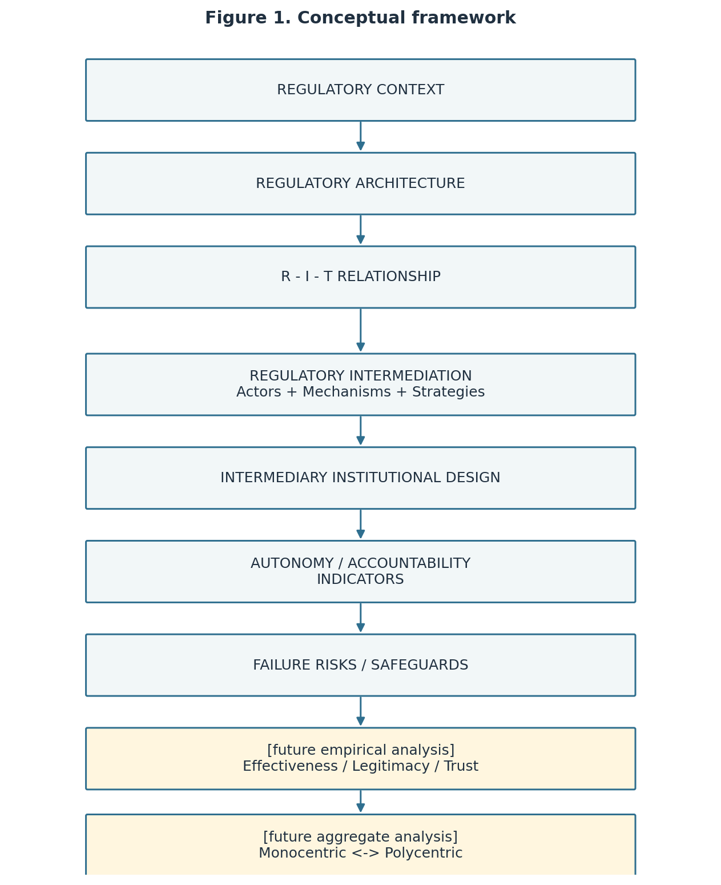
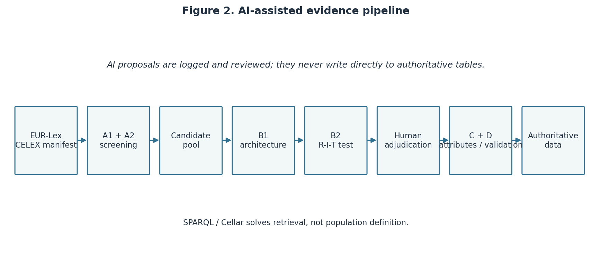
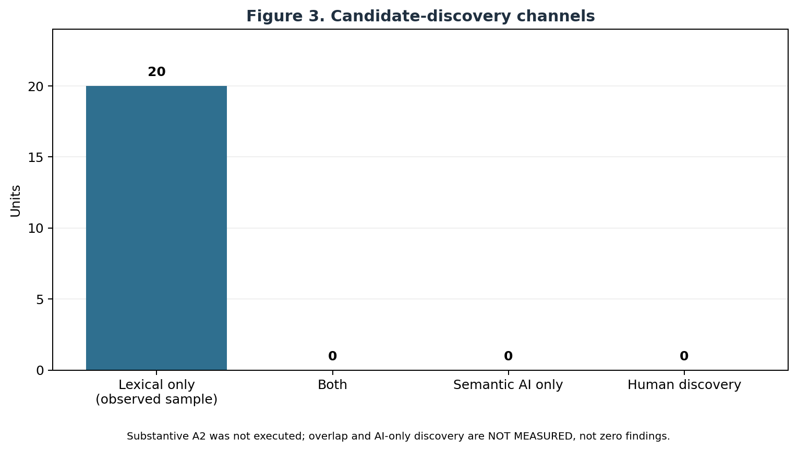
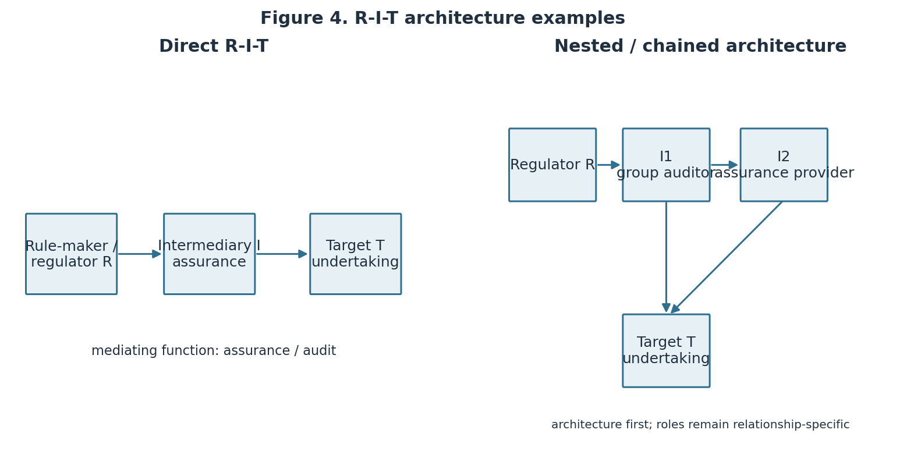
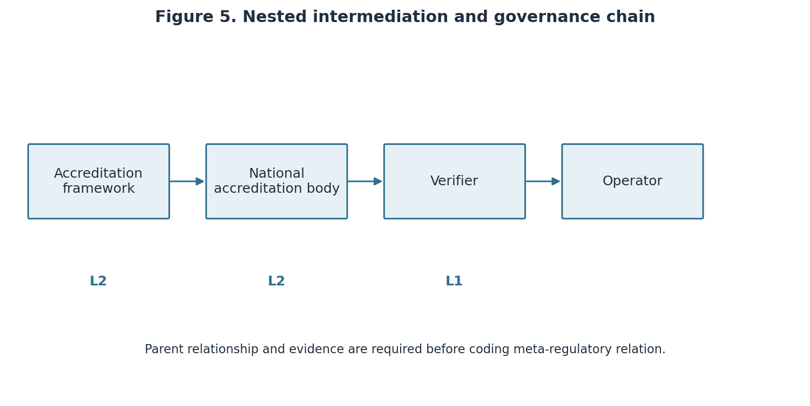
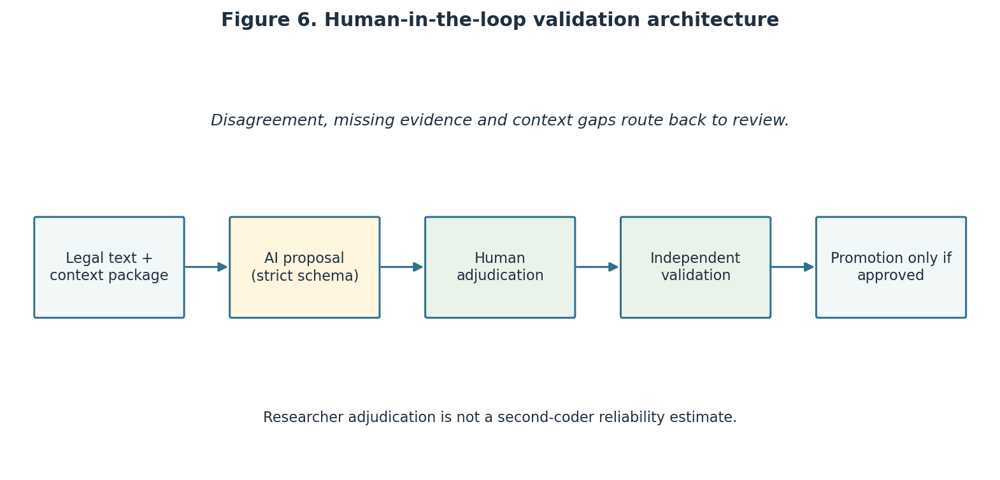

# Executive summary

This report documents the fourth, five-act round of PoC 01 on regulatory
intermediaries. It is prepared for Prof. David Levi-Faur and is designed to
make the whole path auditable: conceptual reading, CELEX selection, legal-text
collection, lexical screening, R-I-T reconstruction, AI-assisted coding and
human adjudication.

The governing instruction is: **Do not code labels; code regulatory
relationships.** A word such as “auditor”, “benchmark” or “competent body” is
only a screening signal. The unit of interpretation is a supported
relationship between a rule-maker/regulator, an analytically distinct
intermediary and a rule-taker/target.

The corpus contains five known EUR-Lex acts: the Corporate Sustainability
Reporting Directive (CSRD), the EU Ecolabel Regulation, the Climate Benchmarks
Regulation, the ETS Verification Regulation and the Taxonomy Regulation. The
five preserved HTML files are non-empty, hash-linked to the manifest and
screened with one versioned pipeline. The four historical acts reproduce the
v3 total of 1,079 screening hits; the Taxonomy Regulation adds 13, for 1,092
hits in all.

The current authoritative R-I-T table deliberately preserves the seven
human-validated v3 relationships. Twenty new units, four per act, were sampled
with a reproducible seed and remain pending independent human adjudication.
No Taxonomy R-I-T relationship is asserted from a lexical hit alone.

The live OpenAI integration was implemented and tested against the account's
model list, with `gpt-5.6-terra` fixed as the operational model id. The first
generation request returned `credit_balance_exhausted`; therefore, this
delivery contains no substantive LLM finding. A 201-call local dry-run
(A2/B1/B2 for 20 units and C for seven inherited relationships, each repeated
three times) passed schema and orchestration checks, but its placeholders are
not results and are not used in the datasets or conclusions.

The prompt-based estimate for those 201 live calls is approximately US$2.2027
at the published `gpt-5.6-terra` rates. This is a planning proxy, not an
invoice; the account dashboard is authoritative.

# Research context and task

The task is a methodological proof of concept for a larger study of
regulatory intermediation. It asks how legal and institutional arrangements
place actors between regulators and targets, which mechanisms they use, and
which design features may support autonomy and accountability. The present
delivery is addressed to David as a transparent hand-off: it records what the
legal corpus can support, what the workflow has tested, and what still needs
human or external evidence.

The core analytical distinction is relational. Actor roles are not intrinsic
properties: `Role(actor) != intrinsic property`; the relevant coding unit is
`Role(actor, relationship)`. The same organisation may be R, I or T in
different relationships. For this reason, the dataset distinguishes
`rule_source`, `standard_setter`, `direct_regulator`, `oversight_authority`,
`enforcement_authority`, `intermediary` and `target`; `R_actor_id` is the
focal role in one reconstructed relationship, not a permanent actor type.

# 1. Conceptual starting point

## 1.1 The construct proposed by Levi-Faur

The theoretical construct is regulatory intermediation: an analytically
distinct actor operates between a rule-maker or regulator and a rule-taker or
target. The central move is from a dyadic regulator-target picture to a
relationship in which someone certifies, audits, ranks, rates, labels or
reports on behalf of a regulatory arrangement.

The proposal organises this field around a triad of actors, mechanisms and
strategies. It also asks how intermediary design connects to autonomy,
accountability, governance modes and, in future work, democratic outcomes.

## 1.2 This PoC's operational proposal

This exercise separates three analytical levels:

1. **Theoretical construct:** regulatory intermediation.
2. **Operationalisation used here:** a five-condition R-I-T test, four
   mechanism families and individual institutional attributes.
3. **Future analytical possibilities:** diffusion, regime-level structure,
   effectiveness, legitimacy, trust and index construction.

The third level is not silently coded in this report. In particular, the
dataset contains no autonomy index, accountability index, effectiveness,
legitimacy, trust or polycentricity score.

## 1.3 Mechanisms and strategies

The four mechanism families are the proposal's own empirical scaffold:

| Mechanism | Typical governance mode in the proposal | Operational signal in this PoC |
|---|---|---|
| Reporting | State-led | disclosure, report, sustainability reporting |
| Certification | NGO-led / scheme-led | certification, competent body, accreditation |
| Ranking/rating | Business-led | benchmark administrator, rating, ranking, score |
| Auditing | Profession-led | auditor, assurance, verification, audit firm |

The mechanisms are not mutually exclusive. The ETS case, for example, can
place auditing and accreditation in a chain. `responsibilization` and
`empowerment` remain independent strategy batteries rather than a forced
either/or variable; they are not scored here.

## 1.4 Why the EU green transition?

The five acts span reporting, environmental labelling, climate benchmarks,
emissions verification and sustainable-finance classification. Together they
offer variation in public authority, professional assurance, private scheme
administration and technical classification. This is a purposeful
methodological sample, not a claim to represent all EU green-transition law.
The Taxonomy Regulation is included as an exploratory discriminant case: its
signals may illuminate where classification and disclosure do not amount to
intermediation.



# 2. Corpus and CELEX rationale

## 2.1 Why CELEX/EUR-Lex

CELEX identifiers make the corpus selection explicit and reproducible. The
pipeline requests a known English HTML record by identifier rather than using
an unconstrained keyword search. Each response is preserved as received,
normalised only for screening text extraction, and linked by SHA-256 hash.

| Act | CELEX | Role in the design | Collected file |
|---|---|---|---|
| Directive (EU) 2022/2464 — CSRD | `32022L2464` | reporting and assurance | `csrd_raw.html` |
| Regulation (EC) No 66/2010 — EU Ecolabel | `32010R0066` | certification | `ecolabel_raw.html` |
| Regulation (EU) 2019/2089 — Climate Benchmarks | `32019R2089` | ranking/rating, conditional validity | `climate_benchmarks_raw.html` |
| Implementing Regulation (EU) 2018/2067 — ETS Verification | `32018R2067` | auditing and accreditation | `ets_verification_raw.html` |
| Regulation (EU) 2020/852 — Taxonomy | `32020R0852` | exploratory sustainability/finance case | `taxonomy_raw.html` |

The source links are the EUR-Lex records for [CSRD](https://eur-lex.europa.eu/legal-content/EN/TXT/?uri=CELEX:32022L2464),
[EU Ecolabel](https://eur-lex.europa.eu/legal-content/EN/TXT/?uri=CELEX:32010R0066),
[Climate Benchmarks](https://eur-lex.europa.eu/legal-content/EN/TXT/?uri=CELEX:32019R2089),
[ETS Verification](https://eur-lex.europa.eu/legal-content/EN/TXT/?uri=CELEX:32018R2067)
and [Taxonomy](https://eur-lex.europa.eu/legal-content/EN/TXT/?uri=CELEX:32020R0852).

## 2.2 Manifest and preservation

`data/CELEX_MANIFEST_v4.csv` records the base and version CELEX, ELI, title,
act type, legal-status/version placeholders, URL, collection
timestamp, response version description, byte count, relative path and hash.
The JSON mirror supports machine reading. A base act and a consolidated or
versioned record are not counted as separate acts. `scripts/validate_v4.py` checks that
all five files exist, are non-empty and reproduce their manifest hash.

# From the PoC corpus to the target population

This PoC corpus is not the target population. A population-scale study first
needs a substantive definition of “EU green-transition act” (for example,
legal instrument types, policy domains, dates, and inclusion/exclusion of
amending and consolidated texts), followed by a frozen retrieval query and a
version-handling rule. SPARQL/Cellar solves retrieval, not population
definition. The manifest therefore makes the five-act choice inspectable
without pretending that the five acts are a prevalence denominator.

# Operational framework and pipeline

The implemented sequence is:

`EUR-Lex -> A1 + A2 -> candidate pool -> B1 -> B2 -> human adjudication -> C -> D validation/error analysis -> authoritative data`.

A1 writes one row per provision and lexical signal. A2 is a complementary
semantic pass. B1 reconstructs all actors and relations before assigning
roles; B2 applies the five-condition test. Human review is a gate, C codes
institutional attributes only for positive relationships, and D checks
foreign keys, missingness, evidence and errors. The live AI layer can propose
records but cannot write directly to the authoritative CSVs.



# 3. Extraction and screening

## 3.1 Stage A1 lexical screening

The screening script tracks the carrier article while traversing paragraph
nodes. It applies independent rules for `actor`, `mechanism` and `instrument`.
This prevents a phrase such as “verification report” from being treated as if
the report and the verifier were the same ontological object.

Anchor patterns receive `high` confidence; generic terms receive `low`
confidence. The `evidence_text` field keeps the exact normalised paragraph
used for the hit. This is salience screening, not a decision that a third
actor actually mediates a relationship.

## 3.2 Screening result

| Act | CELEX | Hits | High | Low |
|---|---:|---:|---:|---:|
| CSRD | 32022L2464 | 559 | 472 | 87 |
| EU Ecolabel | 32010R0066 | 94 | 73 | 21 |
| Climate Benchmarks | 32019R2089 | 61 | 37 | 24 |
| ETS Verification | 32018R2067 | 365 | 182 | 183 |
| Taxonomy | 32020R0852 | 13 | 5 | 8 |
| **Total** | **five CELEX** | **1,092** | **769** | **323** |

The four-act subtotal is exactly 1,079, matching the v3 baseline. The
Taxonomy result is small but non-empty. Its 13 hits trigger closer inspection;
they do not by themselves show that the Taxonomy Regulation creates an
intermediary.


## 3.3 Candidate discovery channels

Candidate discovery is kept decomposable: `LEXICAL`, `SEMANTIC_AI`, `BOTH`
and `HUMAN`. In this delivery the 20 held-out units are lexical-screen
selections and the A2 records are dry-run placeholders. Therefore the
lexical/AI intersection, lexical-only population and AI-only discoveries are
not substantively measured. The zeros in the status table mean “not measured”,
not “no such cases exist”.



| Discovery category | Current v4 status | Interpretation |
|---|---|---|
| `LEXICAL_ONLY` | 20 observed sample selections | selected from A1; A2 was not substantive |
| `BOTH` | Not measured | requires substantive A2 on the same units |
| `SEMANTIC_AI_ONLY` | Not measured | dry-run placeholders cannot establish discovery |
| `HUMAN` | Not measured | no new human discovery adjudication completed |

# 4. From R-T to R-I-T

## 4.1 The five-condition test

Each candidate is evaluated in order:

1. Is an identifiable regulator or rule-maker present?
2. Is an identifiable target or rule-taker present?
3. Is a third actor analytically distinct from both?
4. Does the third actor perform a regulatory function mediating the R-T
   relationship, rather than merely advising the regulator or sharing the
   target's obligation?
5. Is the relationship supported by explicit legal text or a documented
   institutional reconstruction?

Only five YES answers produce `positive`. A NO produces `negative`. An
UNCLEAR condition produces `conditional` or `insufficient_evidence`. A direct
reporting obligation may therefore be a negative R-I-T case, as in the v3
negative control CAND-03.

## 4.2 Architecture before classification

Stage B1 reconstructs all named actors and explicit relations before any R/I/T
assignment. This guards against prematurely treating an accreditation body as
the regulator and missing a peer-evaluation actor above it. Stage B2 then
receives the architecture and answers the five conditions separately.

The ontology remains decomposed:

| Ontology | Question |
|---|---|
| Actor | Who is named or directly implied? |
| Mechanism | What regulatory activity mediates? |
| Instrument | What report, methodology, certificate or rating artefact is used? |
| Procedure | What sequence of application, review, verification or appeal is specified? |
| Institution | What authority, body, profession or organisation occupies the role? |

## 4.3 Current relationship baseline

The current v4 relationship file preserves seven human-validated v3 rows. It
contains the two-level CSRD assurance chain, the Ecolabel certification and
testing relations, and the ETS verification/accreditation chain. Every row has
R, I and T foreign keys, pairwise distinct actors and literal legal evidence.

| Relationship family | Relationships | Reading |
|---|---|---|
| CSRD | RIT-001, RIT-002 | auditing, with reporting in the upstream chain |
| EU Ecolabel | RIT-003, RIT-004, RIT-005 | certification and testing/accreditation |
| ETS Verification | RIT-006, RIT-007 | verification plus accreditation/meta-regulation |
| Taxonomy | none asserted | exploratory; new units pending adjudication |

Negative and conditional cases remain in the candidate layer and are not
entered into the positive relationship table.



# 5. Institutional attributes

For positive relationships, Stage C is restricted to individual attributes:
formal role, voluntariness, mandatory use, regulatory level, sphere, mode of
operation, centrality, organisational separation and legal independence.
The eight attribute families are formal role, voluntarism, level, sphere,
motivation, mode, centrality and separation; supervision is retained as a
separate accountability-related field. Each value carries evidence,
observability class and confidence.
autonomy and accountability batteries remain deferred proposals. A conflict
of-interest rule would indicate a design response to capture; it would not
show that capture occurred.

The same discipline applies to accountability: a named supervisory function
can support `supervision_present = 1`, but that is not an accountability index
and says nothing by itself about effectiveness or legitimacy.

# 6. AI-assisted coding protocol

## 6.1 Scope and safeguards

The AI layer is an assisted proposal layer. It does not replace the R-I-T
test, and it cannot write directly into the authoritative CSVs. The four
stages are:

- **A2:** semantic candidate detection complementary to A1;
- **B1:** architecture reconstruction;
- **B2:** five-condition R-I-T adjudication;
- **C:** institutional attributes for positive relationships.

The prompts require evidence before code, reward abstention, constrain the
model to the supplied legal package, allow one bounded context request and
prohibit outcome/index claims. Strict JSON schemas are validated after every
call. Each unit is repeated three times, and substantive disagreement routes
to human review rather than being averaged.

## 6.2 What was executed

The OpenAI adapter was wired to the Responses API with strict JSON Schema
output and `store=false`. The exact model id selected for this implementation
was `gpt-5.6-terra`, because the account model list exposed it and the current
official model documentation lists Structured Outputs support for the family.
The first generation call returned the provider error
`credit_balance_exhausted`. No substantive response was accepted or logged.

To validate the rest of the pipeline without fabricating a finding, the local
dry-run adapter was executed on 20 audit units: A2, B1 and B2 three times each,
plus Stage C for the seven inherited positive relationships three times each.
This yielded 201 schema-valid log records. All repeated placeholders were
stable, but stability in a dry-run is only an orchestration result.

| Model-selection component | v4 status |
|---|---|
| Primary model implementation | `gpt-5.6-terra` adapter implemented |
| Challenger model | Not executed |
| Tier 0 anchor comparison | Not scored: no substantive output |
| Tier 1 held-out comparison | Deferred: human adjudication and credits pending |
| Model winner / best-model claim | Not reported |

## 6.3 Promotion path

All current AI-related rows are isolated in `data/ai_runs_v4.jsonl`,
`data/ai_runs_v4.csv` and `data/human_review_v4.csv`. A future human promotion must inspect
each literal quote, re-apply the five-condition test and record
`ai_assisted=1` plus an exact `ai_run_ref`. No such promotion has occurred in
this delivery.

# 7. Human audit and held-out sample

The audit sample contains 20 new units, four per act, selected with seed
`20260906`. Articles used by the v3 candidate set were excluded. The sample
is visible in `data/audit_sample_v4.csv`; all rows are `PENDING`.

The required sequence is deliberately strict: human adjudication must be
completed before a live Tier 1 run, so that the model cannot anchor the human
coder. The human record must identify R, I and T, answer conditions (a)-(e),
quote evidence, flag conditional/negative cases and document cross-reference
gaps. One adversarial case must omit a load-bearing cross-reference and check
whether the model requests it instead of relying on parametric knowledge.

Because both the independent adjudication and the API credit gate are
unfinished, this delivery does not report a Tier 1 score, model-selection
winner or AI agreement rate.

# 8. Findings by act

## CSRD

The inherited coding identifies a two-level assurance chain around
sustainability reporting: a group auditor carries responsibility for the
assurance report, and the group auditor evaluates the work of eligible
subsidiary-level assurance providers. The separate direct reporting provision
is retained as a negative control where the reporting duty itself has no
third-party mediator.

## EU Ecolabel

The inherited coding identifies competent bodies as certification
intermediaries and separates testing/verification bodies from the competent
body. Voluntary participation in the scheme and mandatory use of the
competent body once an operator applies are kept as distinct variables.

## Climate Benchmarks

The inherited candidate CAND-07 remains conditional. A benchmark administrator
may be a relevant intermediary, but the specific R-I-T architecture must be
supported by the relevant provision and not inferred from the existence of a
benchmark label. Four new units are pending independent adjudication.

## ETS Verification

The inherited coding distinguishes verification from the accreditation layer.
The chain is methodologically important: a verifier mediates emissions
reporting/verification for an operator, while accreditation and peer
evaluation govern the verifier at another level. This is why the architecture
must be reconstructed before roles are assigned.

## Taxonomy Regulation

The Taxonomy Regulation is deliberately exploratory. Its classification
system, disclosures and technical criteria produce lexical signals, but the
current delivery does not presume that a platform, technical screening
criterion, authority or reporting obligation is an intermediary. Four sampled
units are pending the same five-condition test as the other acts.

# 9. Limitations and next steps

The lexical screen is not a prevalence estimate and cannot distinguish every
institutional role. EUR-Lex HTML presentation can change, so the manifest and
hash are essential. Full legal meaning may depend on cross-referenced acts;
the context-request loop is bounded and unresolved gaps go to human review.

The present AI evidence is procedural, not substantive, because the provider
account had no remaining credits. Before claiming a validated AI-assisted
coder, the next round must:

1. complete independent human adjudication of the 20 held-out units;
2. restore account credits and repeat live three-run A2/B1/B2 calls;
3. execute the adversarial omitted-context test;
4. score evidence fidelity and mechanism validity by human review;
5. update the model-selection results only after Tier 1, never from Tier 0;
6. decide separately whether any further Stage C battery deserves scale.

| Limitation | Control in this delivery | Remaining gap |
|---|---|---|
| Lexical salience is not intermediation | A1 is separate from B1/B2 | substantive adjudication |
| Cross-referenced law may be missing | bounded context escape hatch | retrieve and review requested sources |
| AI proposal may anchor a coder | human gate precedes Tier 1 | complete the 20 independent reviews |
| One provider could not generate | dry-run marked non-substantive | restore credits and repeat |
| Legal text does not show outcomes | no outcome/index fields | future external empirical study |

# 10. Nested intermediation and governance of intermediaries

Nested coding uses `nested_intermediation_present`, `chain_id`,
`intermediation_level` and `parent_relationship_id`. A
`meta_regulatory_relation` is recorded only where the documented parent chain
and evidence support governance of an intermediary by another arrangement.
The ETS accreditation/verifier chain is retained as the stress case; it is not
generalised to every multi-actor provision.



# 11. AI performance, provenance and error analysis

The current run establishes schema validity, repeat-run orchestration and
provenance fields, not AI accuracy. There is no substantive A2/B1/B2 output,
no human-agreement rate, no evidence-fidelity score and no Tier 0/Tier 1 model
winner. `ai_runs_v4.csv` and `ai_runs_v4.jsonl` retain provider, model,
snapshot, reasoning setting, prompt/schema versions, timestamp, hashes,
run_id, usage and cost estimate. `human_review_v4.csv` marks every proposal
as pending.

The error analysis plan compares AI and Human 1 field by field, including
evidence fidelity, condition-level errors, mechanism assignment, abstention
and context requests. A second coder would be required before making any
intercoder reliability claim.



# 12. Construct validity and hard cases

The direct reporting case CAND-03 remains a negative control: a reporting
duty does not itself create an intermediary. Climate Benchmarks CAND-07
remains conditional pending the relevant legal architecture. The Taxonomy
case is exploratory and discriminant, with no presumption that criteria,
classification or disclosure are intermediary mechanisms. The false-
intermediary counterfactual is an interpretive aid, not a substitute for
legal evidence.

# 13. What legal-text coding can and cannot measure

Legal text can support named actors, formal duties, procedures, explicit
mechanisms, supervision requirements and bounded institutional
reconstructions. It cannot by itself establish actual autonomy, capture,
effectiveness, legitimacy, trust, compliance outcomes or democratic quality.
It cannot turn an absence of wording into proof of absence. Missingness is
therefore coded as `NA`, `UNK`, `NOE` or `EXT` as appropriate, and substantive
categories are never silently left blank.

The independent strategy variables `responsibilization_present` and
`empowerment_present` use `1`, `0`, `UNCLEAR` or `NOE`. They are not combined
into a score. Failure fields describe design risks addressed by an
arrangement; they do not show that capture or failure occurred.

# 14. Status of measured, deferred and planned elements

| Element | State in this delivery | Interpretation |
|---|---|---|
| CELEX retrieval, hashes and A1 screen | Implemented and tested | five-act PoC evidence |
| Seven inherited positive R-I-T rows | Preserved and validated in v3 | regression baseline, not new AI findings |
| Twenty held-out human adjudications | Pending | no Tier 1 claim |
| Live AI generation | Blocked by account credits | no substantive model output |
| A2 lexical/semantic overlap | Not measured | requires substantive A2 |
| Autonomy/accountability indicators | Deferred proposal | no indices |
| Effectiveness, legitimacy, trust, polycentricity | Future research | not observable from this PoC |

# 15. From PoC to population-scale research

The next round should freeze the population definition, retrieve base and
consolidated records with explicit deduplication, adjudicate the held-out
sample, restore API credits, run a primary/challenger comparison where
feasible, and publish the error taxonomy. CBAM is the proposed next stress
test because it can probe another carbon-regulatory architecture; it is not
part of this corpus and is not used to enlarge the present findings.

# 16. Conclusion

The delivery demonstrates the intended chain from theory to operationalisation,
legal evidence, interpretation, structured data, validation and a scalable
execution plan. Its substantive conclusion is deliberately narrow: seven
human-validated inherited relationships are preserved; the five-act lexical
screen is complete; new relationships, AI performance and population claims
remain open until the specified human and account gates are completed.

# References and primary sources

- The Levi-Faur proposal supplied for PoC 01 is the theoretical starting
  point and source of the mechanism vocabulary used here.
- [EUR-Lex legal records](https://eur-lex.europa.eu/) provide the five CELEX
  sources listed in the corpus table.
- [OpenAI model comparison](https://developers.openai.com/api/docs/models/compare)
  and [Responses API reference](https://developers.openai.com/api/reference/cli/resources/responses/methods/create)
  document the API features used by the adapter.

# Appendix A — Reproduction commands

From the `Entrega-04` directory:

```text
python scripts/collect_v4.py
python scripts/screening_v4.py
python scripts/prepare_samples_v4.py
python scripts/build_datasets_v4.py
python scripts/run_ai_v4.py --provider dry_run --model dry-run-v4 --include-c
python scripts/build_auxiliary_outputs_v4.py
python scripts/make_figure_v4.py
python scripts/make_figures_v4.py
python scripts/validate_v4.py
quarto render RELATORIO_COMPLETO_INTERMEDIARIES_EN.qmd --to docx
```

The live invocation is intentionally separate:

```text
python scripts/run_ai_v4.py --provider openai --model gpt-5.6-terra
```

It requires account credits and completed independent adjudication of the
held-out sample. It never writes to the authoritative CSVs.

# Appendix B — Delivery inventory

- `data/CELEX_MANIFEST_v4.csv` and `.json`: source manifest and hashes.
- `data/raw_html/`: five preserved EUR-Lex HTML responses.
- `data/screening_hits_v4.csv`: 1,092 Stage A1 rows.
- `data/candidate_adjudications_v4.csv`: 10 inherited rows plus 20 pending rows.
- `data/rit_relationships_v4.csv`: seven inherited positive relationships.
- `data/actors_v4.csv`: 19 inherited actor records.
- `data/audit_sample_v4.csv`: four held-out units per act.
- `data/ai_runs_v4.jsonl` and `.csv`: 201 dry-run schema records with provenance.
- `data/api_cost_estimate_v4.json`: prompt-based estimate for the planned live run.
- `data/api_attempt_v4.json`: provider response metadata from the unsuccessful live attempt.
- `MODEL_SELECTION_RESULTS_v4.md`: model-selection status and blocking condition.
- `figures/`: screening distribution plus Figures 1–6.
- `data/human_review_v4.csv`: units awaiting full review.
- `data/semantic_candidates_v4.csv`: A2 view with explicit dry-run status.
- `data/relationship_mechanisms_v4.csv`: relationship-level mechanism view.
- `data/validation_sample_v4.csv` and `data/challenge_sample_v4.csv`: human
  validation and stress-test samples.
- `EVIDENCE_TABLE_v4.md`: complete literal-evidence table for the inherited relationships.
- `schemas/`: four Structured Outputs contracts.
- `prompts/`: stage prompts and shared guardrails.
- `SCREENING_CODEBOOK_v4.md`, `MODEL_SELECTION_PROTOCOL.md`,
  `AI_CODING_PROTOCOL.md`, `VALIDATION_PROTOCOL_v4.md` and
  `CHANGELOG_FINAL.md`: canonical v4 controls.
- `*_v4.md`: codebooks, data dictionary, variable map, methodology, AI and audit protocols.
